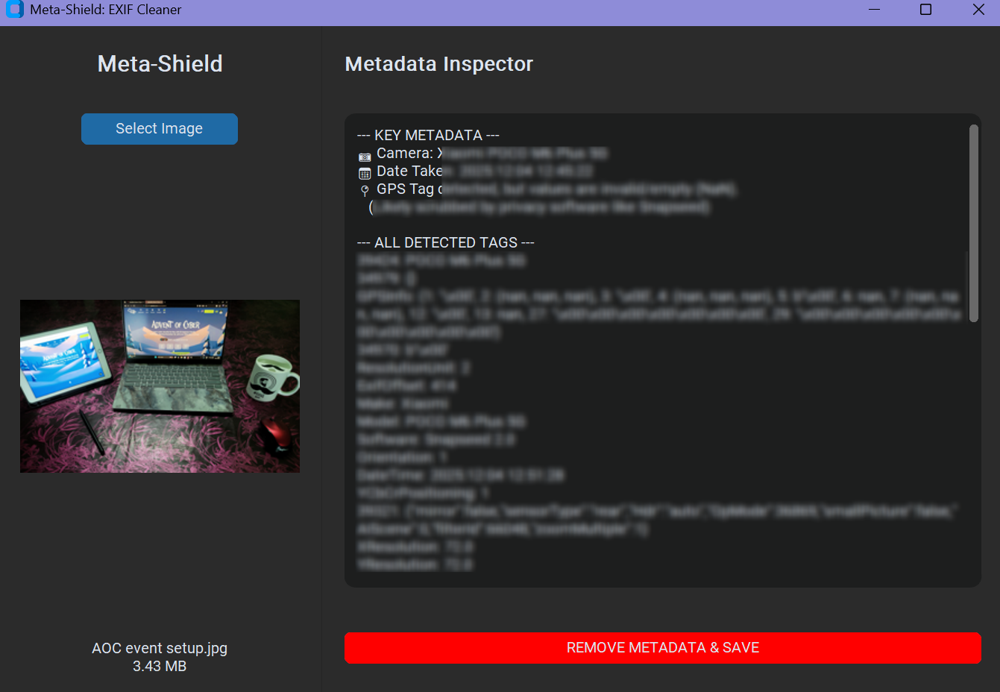

<div align="center">

  

  <h1>🛡️ Meta-Shield Forensics</h1>
  
  <p>
    <b>The Ultimate Privacy & Metadata Sanitization Tool</b>
  </p>

  <p>
    
    
    
  </p>

  <br />
  
  
  <br />
  <br />

</div>

---

### 🔎 Overview
**Meta-Shield** is a Python-based privacy and digital forensics tool designed to inspect, analyze, and "clean" EXIF metadata from digital images. 

In an era where every photo contains hidden data—from GPS coordinates to device serial numbers—Meta-Shield empowers users to see exactly what they are sharing and allows them to sanitize sensitive information before posting online.

---

### 🚀 Key Features

| Feature | Description |
| :--- | :--- |
| **🕵️ Forensic Inspector** | Deep-scan images to reveal hidden tags: **Camera Model**, **Software Version**, **Timestamps**, and **GPS Coordinates**. |
| **🛡️ Privacy Scrubbing** | One-click sanitization that strips *all* metadata layers and saves a clean, safe copy (`filename_clean.jpg`). |
| **🧠 Diagnostic Mode** | Smart logic that detects "Partial Scrubbing" (e.g., when apps like Snapseed remove GPS but leave forensic traces behind). |
| **📂 Drag & Drop** | Seamlessly load JPEG, PNG, or TIFF files with a modern drag-and-drop interface. |
| **🎨 Modern UI** | Built with `customtkinter` for a professional, hacker-style dark mode aesthetic. |

---

### ⚙️ Installation

#### 1. Clone the Repository
```bash
git clone https://github.com/shanuz123/Meta-Shield-Forensics.git
cd Meta-Shield-Forensics
```

#### 2. Install Dependencies

Ensure you have Python 3.10+ installed, then run:
Bash
```
pip install -r requirements.txt
```
#### 3. Run the Application
Bash
```
python meta_shield.py
```
### 🕹️ Usage Guide
  
 - Launch the Tool: Run the script to open the GUI.
 - Load Target: Click "Select Image" or drag an image into the window.
 - Analyze: Review the "Metadata Inspector" panel on the right.
   - Red Text indicates high-risk data (like GPS).
   - Yellow Text indicates forensic warnings (like modified software).
 - Sanitize: Click the "REMOVE METADATA & SAVE" button.
   - A new file will be created in the same folder with _clean appended to the name.

### 🛠️ Technology Stack

 - Language: Python 3.x
 - GUI Engine: CustomTkinter
 - Image Processing: Pillow (PIL)
 - Development Acceleration: Google Antigravity (Generative AI)

### 📜 License

This project is licensed under the MIT License. See the LICENSE file for details.

<div align="center"> <i>Built for Security Researchers, OSINT Analysts, and Privacy Advocates.</i> </div>
